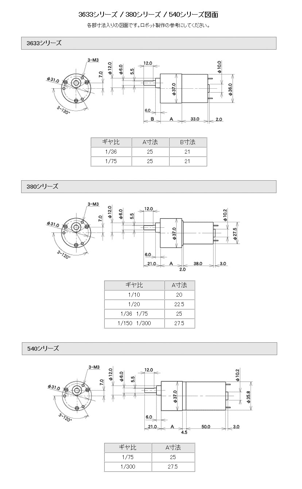

# 第２回設計課題「モーターの概形設計」
今回は、F3RCにて足回りによく使われるモーター「Tamiya 380K75」をデータシートを見ながら設計してもらおうと思います。

## 完成図

.png)

.png)

## 手順
1. 以下のデータシートを参考にCADデータを設計してみましょう

**（380シリーズのギア比1/75を設計してください）**

2. CADデータ[「モーターマウント」](./CAD_data/Tamiya_MotorMount.SLDPRT)をダウンロードし、作成したTamiya 380K75と組み合わせたアセンブリを作成してみましょう

## 注意事項
* モーターは1つの部品で作ること

* 寸法が明記されていない箇所は設計しなくて大丈夫です

* 3-M3は直径3.0mmの穴を3つ作成するということです（深さは３mmにしてみてください）

* ねじのイラストの描かれた部分には穴を開けなくて大丈夫です

* モーターマウントと組み合わせてエラーが出た場合、合致の仕方が間違っているかモーターの設計が間違っているかのどちらかです

---

[ホーム](index.md)