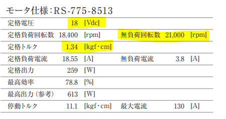

# 第２回「アクチュエータについて」

## モータについて

### カタログの読み方

モータの選定時には注意すべき点がいくつかあります

以下には特に注意すべき3つの項目を挙げますので、選定の参考にしてください

* V : 定格電圧
* rpm : 無負荷回転数
* Nm : 定格トルク (1N = 0.1kgf)

実際のカタログでは上の表のようにまとめられています

無負荷回転数と定格負荷回転数の違いについては、特に気にしなくても良いですが、実際の回転数は無負荷回転数より少なくなることに注意しましょう

### モータの種類

ロボコンなどで使われるモータは4種類あります

1. ブラシ付きDCモータ　

2. ブラシレスDCモータ　

3. ステッピングモータ　

4. サーボモータ

この中でブラシ付きDCモータは減速機といわれるものをつけて利用されることが非常に多いです

※減速機については後述します

#### ブラシ付きDCモータ（DCモータ）

DCモータといわれるもので、一般的にモータといわれるとこれを想像する人が多いです

当サークルでよく使われるDCモータは3種類あり、トルクの大きい順に、

朱雀775、タミヤ540、タミヤ380で、
それぞれのスペックは以下のとおりですので、カタログの読み方を参考に確認しておいてください

 

※スペックを見比べて、不思議に思った人もいると思いますがタミヤ380と540のスペック表は減速比を1:75にした場合なので、モータのみの場合と比較することはできません

#### ブラシレスDCモータ

当サークルでは、いつか使いたいと画策しているもので、速度制御の面などで大きな利点があり、電気自動車などに利用されています

※ブラシレス、ブラシ付きについてもっと知りたい方は各自で調べてみてね

#### ステッピングモータ

通常のDCモータの場合、特殊な測定器具（エンコーダなど）によって、モータがどれほど回転したかをフィードバックすることで制御しますが、ステッピングモータはそういった器具なしに相対的であれば制御が可能なモータです

想定以上の負荷がかかった場合、うまく回転しない（脱調）ことがあるので注意しましょう

基本的には秋月電子で購入することが多く、
実際に調べてみるとバイポーラとユニポーラの2つの種類がありますが、基本的にはバイポーラを使います

定格が12Vの場合、SM-42BYG011がおすすめです

#### サーボモータ

サーボモータはエンコーダなしに絶対的な制御が可能となるモータですが、回転角に限度があるので注意しましょう

注）ローテーションサーボは厳密にはサーボモータではありません！！

また、負荷のかかるところにはプラスチック製ではなく、メタル製のギアを用いることを心がけましょう

個人的におすすめのサーボモータはMG996Rで、メタル製のギア、回転角は180°となっています

 さらにトルクの大きいサーボモータに60㎏サーボというのがあります
 

## 減速機

DCモータ単体ではトルクがいまいち足りないことが多々あるので、減速機を用いて回転数を減らし、代わりにトルクを大きくすることができます

ここで減速機の1種で、これからたびたびお世話になるギヤボックスについて紹介します

ギヤボックスとは、ギヤといわれる歯車をいくつか噛み合わせ、ギヤ比といわれるものを変化させます

（ギヤボックスのついたモータのことを普通ギヤードモータといいます）

どれほどトルクや回転数が変化するかはギア比によってわかります！

今回のは定格許容トルクのため、トルクは単純に4倍とはなりませんが、トルクが大きくなっていることが分かります

## エンコーダ（ロータリエンコーダ）

当サークルで使うロータリエンコーダは2種類あり、左の軸ありエンコーダはギアを一度かませることが必要ですが、右のホール型のエンコーダは軸にそのままさすことでも利用できます

この画像では右側がエンコーダで左側がモータとなっています
このように軸のあるエンコーダはギヤを一度かませるなどして設置します

ホール型のエンコーダは手軽に利用でき、また安いものもあり、[AMT102-V](https://www.digikey.jp/ja/products/detail/cui-devices/AMT102-V/827015)がおすすめです

ほかのサイトでも売られているので、値段と納期で比較してどこで買うかを決めましょう

## 可変抵抗器（ポテンショメータ）

可変抵抗器はエンコーダと同じく、回転を測定することができますがエンコーダが相対的な測定に対し、可変抵抗器は絶対的な位置制御を可能にします

但し、サーボモータと同じように回転角に限界があります

秋月電子などで売られているので、各自確認しましょう

## エアシリンダについて

エアシリンダはモータと違って、回転運動ではなく直進運動を発生させます

必要なものはそれなりにありますが、制御的に簡単なため機構班としては使い方をしっかり理解し、利用できるようにしましょう

### 必要なもの

* エアシリンダ本体
* 継手
* チューブ
* エアタンク（2L炭酸ペットボトル）
* 電磁弁

概要図.png)

#### 本体

本体には単動型と複動型の2種類があり、単動型は内部にバネを入れることで、ポートが１つになっています

単動型では空気を供給時（排気時）にロッドが伸び、排気時（供給時）に縮みます

複動型では

①ロッドが伸びる

②ロッドが縮む

単動型はバネを使う分値段が高くなる場合があるので確認しておきましょう

注）今回は複動型を利用する前提として解説を進めます

#### 継手

基本的にはシリンダとチューブの選定の際にそれぞれの規格が分かるので、それにあった継手を選択します

**チューブの外径**と**接続ねじの呼び**に注意して選定してください

継手の1種に**スピードコントローラ**というものがあり、流量を制限できるのでロッドをゆっくり出し入れすることが可能になります

#### チューブ

特筆すべき点はありませんが、選定時には特にチューブの外径に注意しましょう
外径が小さければ、その分チューブを流れる空気の量が少なくなりますので気をつけてください

注）当サークルでは主に6㎜が使用されています

#### エアタンク

空圧を利用する際にはエアタンクが必要で、当サークルでは自作して利用しています

利用するのは2L（1.5L）の炭酸ペットボトルで、破裂時のけが防止のためにガムテープ等でペットボトルを巻く必要があります

キャップ部分には特殊な器具を取り付けていますが、現段階では知らなくても大丈夫です

#### 電磁弁

[シングルソレノイドとダブルソレノイド](https://www.iwakipumps.jp/blog/naruhodo/27/)

モータで言うところのモータドライバにあたる部分が電磁弁となります。
制御するのに必要なので、電装及び制御と話し合っておきましょう。

通常、単動型ならば3ポートの電磁弁を、複動型なら5ポートの電磁弁を用意します

注）電磁弁は例えるならばその時その時で1つの指令しか出せない指令室で、1つあればいいというわけでもありません。
指令のタイミングが違ったり、それぞれ違う指令だったりするときには電磁弁は複数個必要になります.png)

## スライド

<iframe src="https://onedrive.live.com/embed?cid=F46394284A6AC4B6&amp;resid=F46394284A6AC4B6%2111741&amp;authkey=AHaL85_HvynZ4aY&amp;em=2&amp;wdAr=1.7777777777777777" style="aspect-ratio:32/19;width:'100%';height:'100%'" width="100%" frameborder="0">これは、<a target="_blank" href="https://office.com/webapps">Office</a> の機能を利用した、<a target="_blank" href="https://office.com">Microsoft Office</a> の埋め込み型のプレゼンテーションです。</iframe>

## 参考文献
* [https://media.suzakugiken.jp/suzaku/catalogue/catalog_dcgm_RS775GM.pdf](https://media.suzakugiken.jp/suzaku/catalogue/catalog_dcgm_RS775GM.pdf)
* [https://ev-tech.jp/technology/motor/page001.html](https://ev-tech.jp/technology/motor/page001.html)
* [https://www.tamiya.com/japan/robocon/topics/gearedmotor170928.html](https://www.tamiya.com/japan/robocon/topics/gearedmotor170928.html)
* [https://www.orientalmotor.co.jp/om/knowledge/uroko_bl/bl02.html](https://www.orientalmotor.co.jp/om/knowledge/uroko_bl/bl02.html)
* [https://akizukidenshi.com/catalog/g/gP-05372/](https://akizukidenshi.com/catalog/g/gP-05372/)
* [https://www.digikey.jp/ja/products/detail/cui-devices/AMT102-V/827015](https://www.digikey.jp/ja/products/detail/cui-devices/AMT102-V/827015)
* [https://www.monotaro.com/g/00161736/](https://www.monotaro.com/g/00161736/)

* [https://jp.misumi-ec.com/vona2/detail/221006300138/](https://jp.misumi-ec.com/vona2/detail/221006300138/?KWSearch=%e3%82%a8%e3%82%a2%e3%82%b7%e3%83%aa%e3%83%b3%e3%83%80&searchFlow=results2products&list=PageSearchResult)
* [https://jp.misumi-ec.com/vona2/detail/221006294972/?list=PageCategory](https://jp.misumi-ec.com/vona2/detail/221006294972/?list=PageCategory)
* [https://jp.misumi-ec.com/vona2/detail/110300335060/](https://jp.misumi-ec.com/vona2/detail/110300335060/)
* [https://punjabisongspb.com/?p=173](https://punjabisongspb.com/?p=173)
* [https://hackmd.io/@moden3/HJzjAS9BD#空気圧](https://hackmd.io/@moden3/HJzjAS9BD#%E7%A9%BA%E6%B0%97%E5%9C%A7)
* [https://akizukidenshi.com/catalog/g/gP-00111/](https://akizukidenshi.com/catalog/g/gP-00111/)

## 第２回設計課題
今回の設計課題については [こちら](./exercise_2.md) をご覧ください。

---

[第１回](Lecture1_SOLIDWORKSintro.md)　　　[ホーム](index.md)　　　[第３回](./main-mecha_1.md)