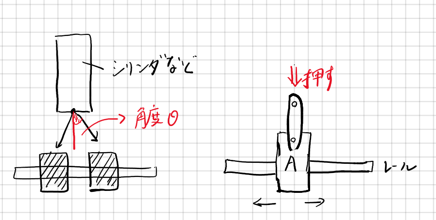

# 第４回「主駆動機構（２）」

前回に引き続き、主駆動機構を扱っていきます。今回は、回転軸とリンク機構の２つをご紹介します。

# 1. 回転軸
## はじめに
今回は、前回扱った回転機構などにて併用されることが多い回転軸の基礎を扱っていきます。ここでは「軸の締結方法」と「ベアリング」「セットカラー・フランジ」「カップリング」の使い方について理解を深めていきましょう。

## 軸の締結方法
### 基礎事項
回転体と軸の締結は、ロボット設計においては避けることのできない内容です。ギアを軸に固定する方法を知らなければ、実際に動くものを作ることはできません。ここでは、ロボコン界隈でよく耳にする「止めねじ」と「マシンキー」についてご紹介していきます。

### 止めねじ
ロボコンにおいて最も一般的に利用されているのがこの止めネジを用いた締結方法です。D字にカットされたモーターの軸にホイールを締結させることから、回転軸に直接ギアを締結させることまで、大きい部品にも小さい部品にも幅広く用いられています。

以下の画像をご覧ください。これがD字にカットされたモーターの軸に平ギアを締結させた時の例です。

.png)

ギアの上側に空いている穴に止めねじを噛ませ、D字にカットされた軸を押さえ込む形で締結させます。

ちなみに、止めねじとは以下の画像のようなネジのことで、レンチで硬く締めて締結させます。

.png)

また、D字にカットされていない場合にも止めねじで締結させることが多いです。以下の画像をご覧ください。

.png)

ここでは、傘歯車と回転軸を溝なしで直接締結しています。この方法でもしっかりと固定することができ、実際にずれてしまうことはほとんどありませんでした。

### マシンキー
かなり大きな負荷がかかる場合などに利用されるのがキーを使う締結方法です。

以下の画像のようなキー溝のついた回転軸にキーを差し込み、回転体と締結します。

.png)

以下の画像がそのイメージです。

（[https://keiorogiken.wordpress.com/2016/12/15/%e3%83%ad%e3%83%9c%e3%83%83%e3%83%88%e8%a8%ad%e8%a8%88%e3%81%ae%e5%8b%98%e6%89%80%e3%80%80%ef%bd%9e%e8%bb%b8%e3%81%a8%e5%9b%9e%e8%bb%a2%e4%bd%93%e3%81%ae%e7%b7%a0%e7%b5%90%ef%bd%9e/](https://keiorogiken.wordpress.com/2016/12/15/%e3%83%ad%e3%83%9c%e3%83%83%e3%83%88%e8%a8%ad%e8%a8%88%e3%81%ae%e5%8b%98%e6%89%80%e3%80%80%ef%bd%9e%e8%bb%b8%e3%81%a8%e5%9b%9e%e8%bb%a2%e4%bd%93%e3%81%ae%e7%b7%a0%e7%b5%90%ef%bd%9e/) より引用）

### その他の締結方法（参考）
回転体と軸の締結方法については、ロ技研の先輩が記事でまとめています。気になる方は [こちら](https://keiorogiken.wordpress.com/2016/12/15/%e3%83%ad%e3%83%9c%e3%83%83%e3%83%88%e8%a8%ad%e8%a8%88%e3%81%ae%e5%8b%98%e6%89%80%e3%80%80%ef%bd%9e%e8%bb%b8%e3%81%a8%e5%9b%9e%e8%bb%a2%e4%bd%93%e3%81%ae%e7%b7%a0%e7%b5%90%ef%bd%9e/) をチェックしてみてください。

## ベアリング
### 基礎事項
回転軸を固定する際に、回りやすくするための部品をベアリング（ラジアルベアリング）といいます。まずは、以下の画像をご覧ください。

.png)

このように、中にボールなどの回転しやすいものが入っているため、これを用いて固定することによって回転を維持しつつ取り付けることができます。

以下の画像がベアリングの使用例です。

.png)

左側の軸は、回転軸を直接アルミ板に繋げるのではなく、ベアリングを挟むことで回転のしやすい機構になっています。また、右側の軸は車輪的な役割としてベアリングを採用した機構です。

ベアリングは、ある程度の負荷に耐えることができるため、重量のかかる部分にも比較的使用できるのが特徴です。

ここで、以下の画像をご覧ください。この画像は、前回も出てきたものだと思いますが、今見ると見え方が変わってくるのではないでしょうか。

.png)

4方向からベアリングを挟むことで直動機構がスムーズになるということがみて取れるのではないでしょうか。

### スラストベアリング
さて、ここまで紹介してきたのが内側と外側が独立して回るラジアルベアリングだったのに対し、上側と下側が独立して回転するスラストベアリングというものも存在します。

以下の画像をご覧ください。

.png)

これがスラストベアリングと呼ばれるものになります。上側からの荷重に強いため、回転盤などに利用されていることが多いです。

また、以下の画像がラジアルベアリングとスラストベアリングを両方用いた例です。

（[https://55life555.blog.fc2.com/?tag=%E3%83%9C%E3%83%BC%E3%83%AB%E7%9B%A4&page=1](https://55life555.blog.fc2.com/?tag=%E3%83%9C%E3%83%BC%E3%83%AB%E7%9B%A4&page=1) より引用）

このように、ベアリングはラジアル方向に用いるか、スラスト方向に用いるかを考えて設計していきましょう。

## セットカラー・フランジ
### 基礎事項
セットカラーやフランジは、回転軸に自作したギアを固定したり、ホイールを固定するために利用する部品です。以下の画像をご覧ください。

.png)

左側がセットカラー、右側がフランジです。どちらも似た部品ですが、フランジの方が高価であるため、ロ技研ではセットカラーが愛されている印象を受けます。

セットカラーは主に、
* 回転軸上の位置固定
* 回転軸への自作ギアの固定
などに利用されています。以下の画像をご覧ください。

.png)

このように、回転軸以外にも穴の空いたものがあり、ギアと組み合わせて軸に直接固定することができます。

この場合、モーターと直接締結させていますが、しっかりと止めることができていればずれるなどの問題はありません。

## カップリング
### 基礎事項
カップリングとは、軸と軸を締結・延長させるための部品です。部品によっては軸の径が異なるもの同士を締結することもできます。

以下の画像をご覧ください。

（[https://jp.misumi-ec.com/tech-info/categories/machine_design/md05/d0011.html](https://jp.misumi-ec.com/tech-info/categories/machine_design/md05/d0011.html) より引用）

左側に描かれているのは、モーターとボールねじをカップリングにて固定している様子です。

また、右側に描かれているのは、カップリングの種類です。主にこちらにあるように2種類（偏心・偏角）のカップリングがあります。

加えて、以下の画像をご覧ください。

（[https://jp.misumi-ec.com/tech-info/categories/machine_design/md05/d0011.html](https://jp.misumi-ec.com/tech-info/categories/machine_design/md05/d0011.html) より引用）

こちらに書かれているように、偏心・偏角の種類以外に構造によるバリエーションがあります。NHKロボコン2022の足回りには、許容トルクの高いオルダムのタイプのカップリングを用いています。バリエーションや種類は使用用途に応じて考えていきましょう。

以下の画像が使用例です。

.png)

カップリングを用いて軸を延長し、モーターと回転軸を締結させているのがわかると思います。

# 2. リンク機構
リンク機構は設計の幅を広げてくれる重要な機構要素の一つです

例えば、電車のパンタグラフなど日常生活でも目にすることが多いと思われます

ロボットの分野では、特にロボットハンドに利用されることが多い印象です

設計時は数値計算等を行うというよりも、CADソフトなどを利用してシミュレーションしてみたり、実際に試作品を作ったりして実際に動くかを確かめるような手探りの作業になります

<iframe width="584" height="578" src="https://www.youtube.com/embed/ASsioh8asQo" title="YouTube video player" frameborder="0" allow="accelerometer; autoplay; clipboard-write; encrypted-media; gyroscope; picture-in-picture" allowfullscreen></iframe>

## 必要なもの

* リンク本体部分（板部分）
* ジョイント部分

特にジョイント部分には普通のねじで結ぶこともあれば支点用段付きねじというものを使う場合もあります

滑りの良さとしては、

普通のねじ　＜　段付きネジ　＜　段付きネジ＋ベアリング

（場合によってはヒンジピンといわれるものを使うこともあります）

通常は段付きねじを利用します

## リンク機構の例

* 平行クランク（リンク機構ではなくクランク機構という意見もあります）

平行移動が可能です

* 簡単なハンド

ハサミの構造と同じですが、最も簡単なリンク機構を用いたハンドとなります

右ではそのモデル化をし、シミュレーションしてみました

このハンドの場合、利用するアクチュエータは恐らく空圧になり、シリンダのストロークによりハンドの開閉が行われます

 

* [より実用的なハンド](https://jp.misumi-ec.com/ec/incadlibrary/detail/000835.html)

この機構よくよく見れば、このページの一番上のリンク機構によるハンドと実質的な構造は変わりませんが、先端の部分にレールを敷くことで、より動きやすくなっている点がいいと思われます

* おまけ　疑似歩行リンク

[まるで歩行している可能ように見えるリンクです]
(https://twitter.com/i/status/1246614778392576000)

他の疑似歩行リンク

---

＜注意事項＞

リンクの設計の際に、注意しなくてはいけないことがあります

それはリンクはある種、力のベクトルを変えるものとも捉えることができ、力のベクトルの変化が90°の場合、想定した動きをしない可能性があるということです

上の図では、θが90°や180°に近い場合、うまく機能しない可能性があります

というのも、右側のリンク機構を見ればわかりますが、この状況で押した場合モジュールAは右と左どちらに動くでしょうか？

詳しくは**自由度**や**対偶**等の用語を使って説明されますが、ここでは割愛したいと思います

 よって、リンク機構の設計及び利用する際には、リンクには回転角度に限界があることに注意しましょう！

## スライド

 <iframe src="https://onedrive.live.com/embed?cid=F46394284A6AC4B6&amp;resid=F46394284A6AC4B6%2111743&amp;authkey=AHTv2YAYIrW4B30&amp;em=2&amp;wdAr=1.7777777777777777" style="aspect-ratio:32/19;width:'100%';height:'100%'" width="100%" frameborder="0">これは、<a target="_blank" href="https://office.com/webapps">Office</a> の機能を利用した、<a target="_blank" href="https://office.com">Microsoft Office</a> の埋め込み型のプレゼンテーションです。</iframe>

## 参考文献
* 回転体と軸の締結：

    [https://keiorogiken.wordpress.com/2016/12/15/%e3%83%ad%e3%83%9c%e3%83%83%e3%83%88%e8%a8%ad%e8%a8%88%e3%81%ae%e5%8b%98%e6%89%80%e3%80%80%ef%bd%9e%e8%bb%b8%e3%81%a8%e5%9b%9e%e8%bb%a2%e4%bd%93%e3%81%ae%e7%b7%a0%e7%b5%90%ef%bd%9e/](https://keiorogiken.wordpress.com/2016/12/15/%e3%83%ad%e3%83%9c%e3%83%83%e3%83%88%e8%a8%ad%e8%a8%88%e3%81%ae%e5%8b%98%e6%89%80%e3%80%80%ef%bd%9e%e8%bb%b8%e3%81%a8%e5%9b%9e%e8%bb%a2%e4%bd%93%e3%81%ae%e7%b7%a0%e7%b5%90%ef%bd%9e/)

* ラジアルベアリングとスラストベアリングの使用例：

    [https://55life555.blog.fc2.com/?tag=%E3%83%9C%E3%83%BC%E3%83%AB%E7%9B%A4&page=1](https://55life555.blog.fc2.com/?tag=%E3%83%9C%E3%83%BC%E3%83%AB%E7%9B%A4&page=1)

* カップリングの基礎：

    [https://jp.misumi-ec.com/tech-info/categories/machine_design/md05/d0011.html](https://jp.misumi-ec.com/tech-info/categories/machine_design/md05/d0011.html)

* [リンク機構の例一覧【40動画以上】 - 機械設計学習館](https://md-study.com/link-mechanism/#i-20)
* [支点段付ねじ　六角穴 \| ミスミ \| MISUMI-VONA【ミスミ】](https://jp.misumi-ec.com/vona2/detail/110302642870/?list=PageCategory)
* [https://d-engineer.com/kikaiyouso/link.html](https://d-engineer.com/kikaiyouso/link.html)
* [http://karakurist.jp/?p=52](http://karakurist.jp/?p=52)
* [【部品組合せテンプレート】 リンクを用いた簡易位置決め機構 \| inCAD Library (misumi-ec.com)](https://jp.misumi-ec.com/ec/incadlibrary/detail/000835.html)
* [https://twitter.com/UniverCurious/status/1246614778392576000](https://twitter.com/UniverCurious/status/1246614778392576000) 

# 4. 第４回設計課題
今回の設計課題については [こちら](exercise_4.md) をご覧ください。

---

[第３回](main-mecha_1.md)　　　[ホーム](index.md)　　　[第５回](main-mecha_3.md)