# 第5回「加工について」

ここでは、SOLIDWORKSでの図面の作成方法と工場（マニュファクチュアリングセンター）での加工の基本作法についてご紹介していきます。

## 1. SolidWorksによる図面の作成方法
1. ホームより図面をクリック（ほかの経路もあります）

   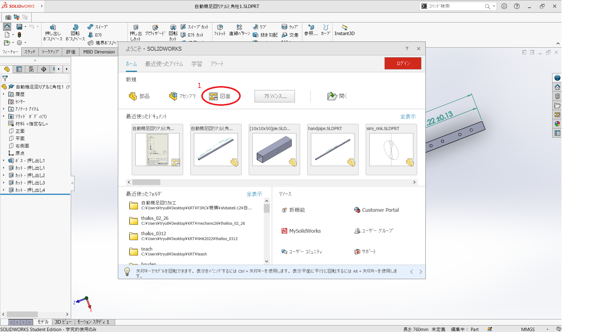

2. 左上のモデルビューを選択し

3. 参照を選択します（挿入する部品やアセンブリがすでに表示されている場合もあります）

   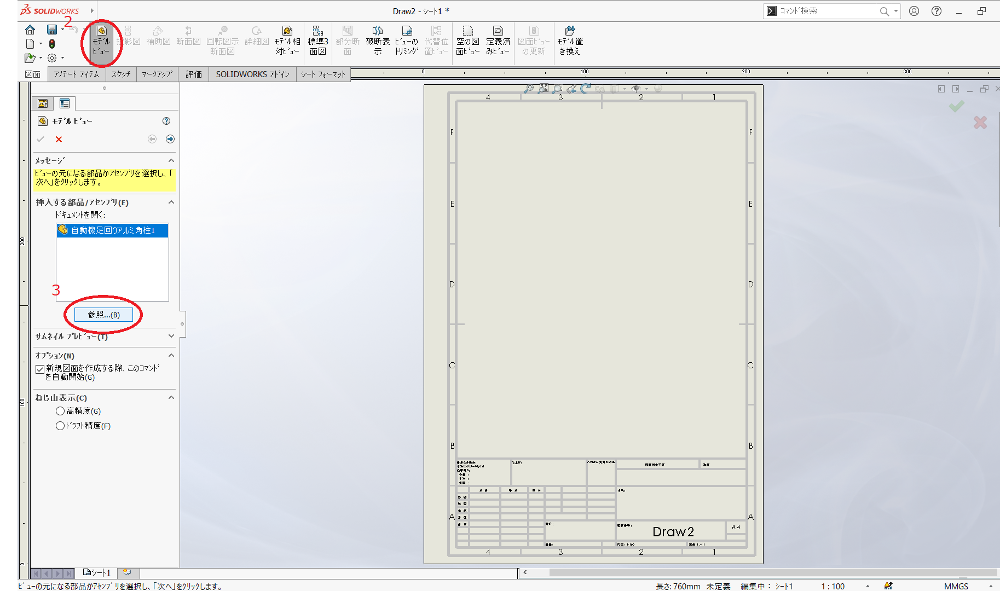

4. 複数ビューの作成にチェックを入れ、

5. 赤い四角形で囲まれたものをすべて選択します（ここはお好みで表示向きの追加・削除をしてください）

   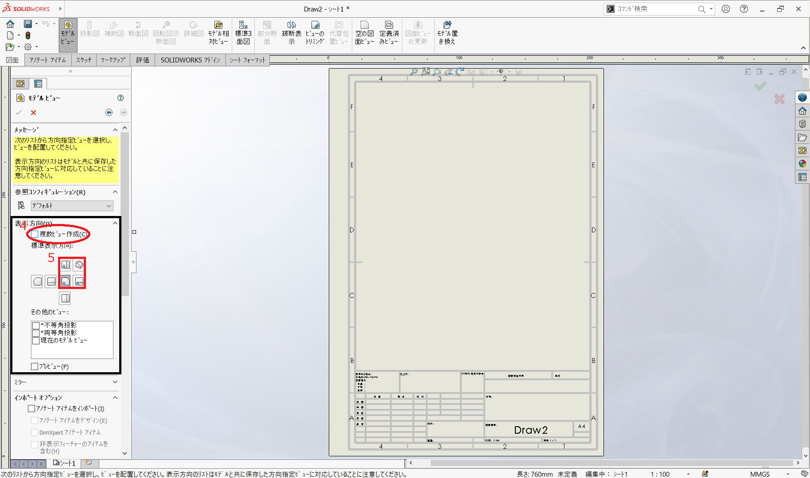

6. 右クリック長押しでカーソルを上のほうにフリックすると、簡単に寸法モードになります

   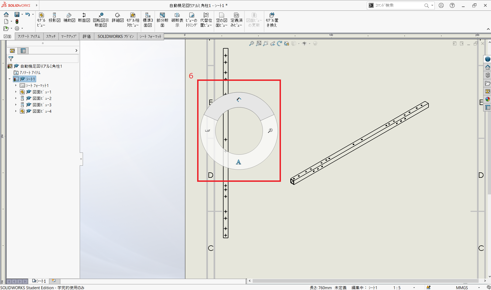

7. あとは必要な箇所に寸法をふっていきます

   必要な箇所は（角柱の場合）

   * 全体の長さ
   * 角柱の横のサイズ（今回ならば10x10）
   * 穴の大きさ
   * 穴の位置（対称であれば、一方を省略してもいいです）
   
   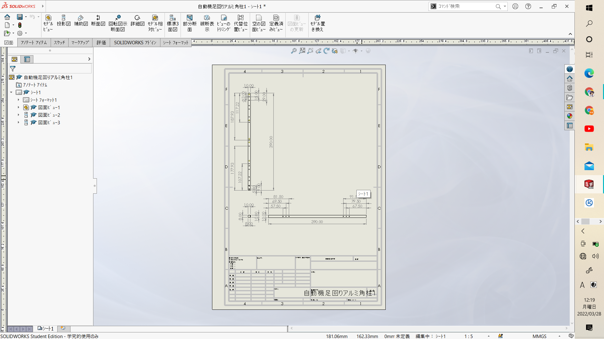

   そのほか、加工時に必要な寸法があれば、記入します

8. 右上の保存ボタンの横にある逆△で開いて、指定保存を選択します

   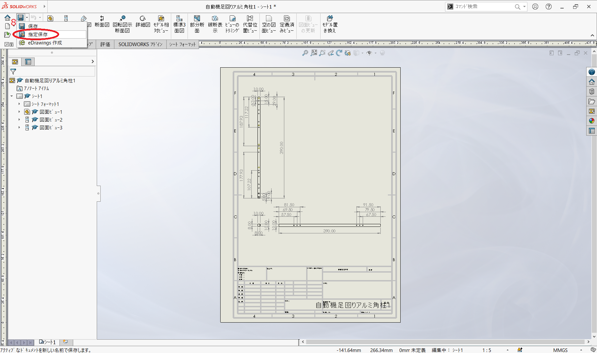

9. ファイルの種類をPDFにすれば、印刷が容易なファイル形式になります
   加工当日までに紙で図面を用意するといいでしょう
   
      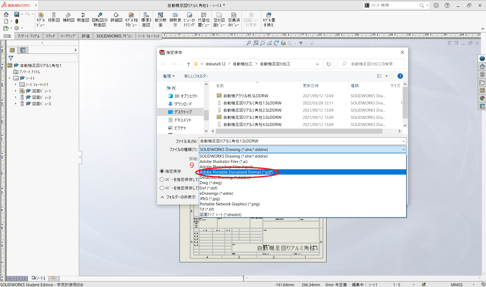

　ちなみにファイルはPDF形式とsolidworksの図面形式（SLDDRW）2つあると変更時に図面を修正しやすいので、図面形式を捨てないように注意しましょう

PDF形式：編集不可

図面形式：編集可

## 2. 加工時の基本作法
工場には、様々な加工のできるいろいろな工作機械が揃っています。ここでは、主にアルミ角柱の加工に用いられる「帯鋸」「フライス盤」「ボール盤」について見ていきましょう。

### 帯鋸
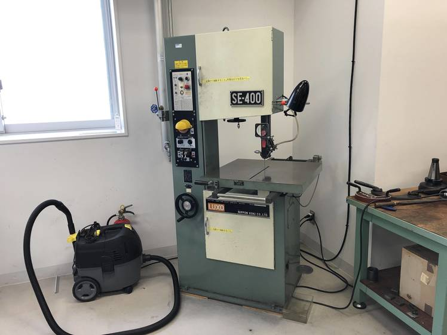

主にアルミ角柱やアルミ板を大雑把な長さに切断する機械です。

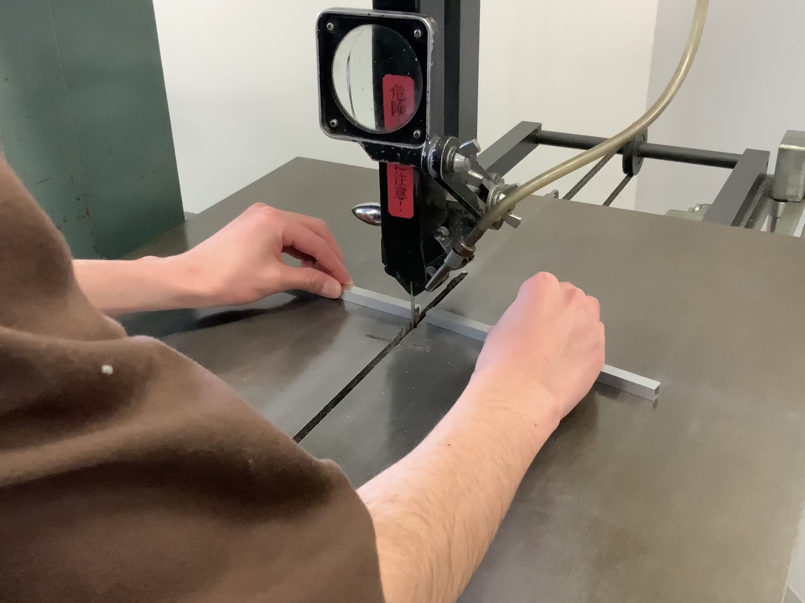

購入したアルミ角柱を大雑把な長さに切断するために利用します。切断する前に、切断したい長さより5mm程度長めの場所に印をつけてから加工するのが通例です。
小学校の図工で使ったであろう糸鋸と同じような機械だと想像していただけると良いと思います。

### フライス盤
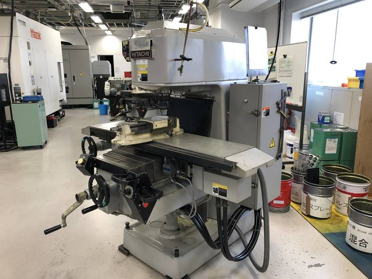

主に帯鋸で大雑把に切断したアルミ角柱を正確な長さに揃える機械です。

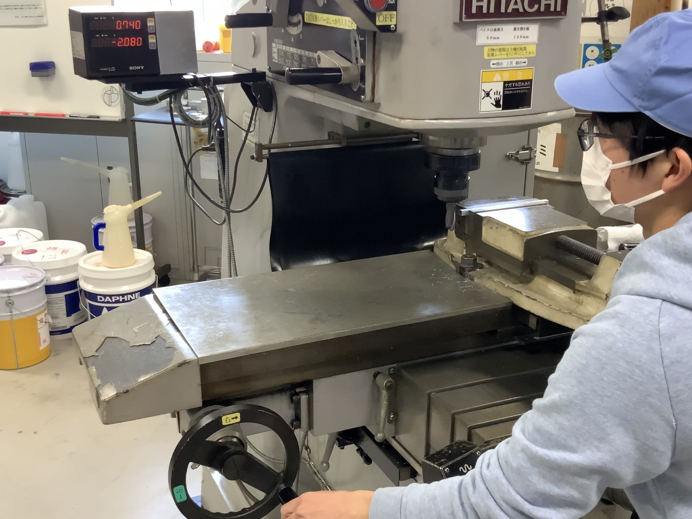

アルミ角柱を正確な長さに揃えるために利用します。帯鋸で大雑把に切断したものを、ノギスが正確に読み取れれば0.05mm単位で揃えることができます。

### ボール盤
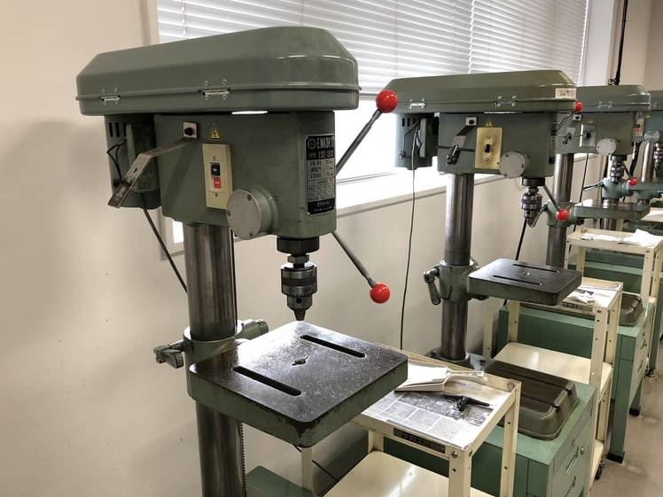

直径13mmまでの穴を開ける機械です。

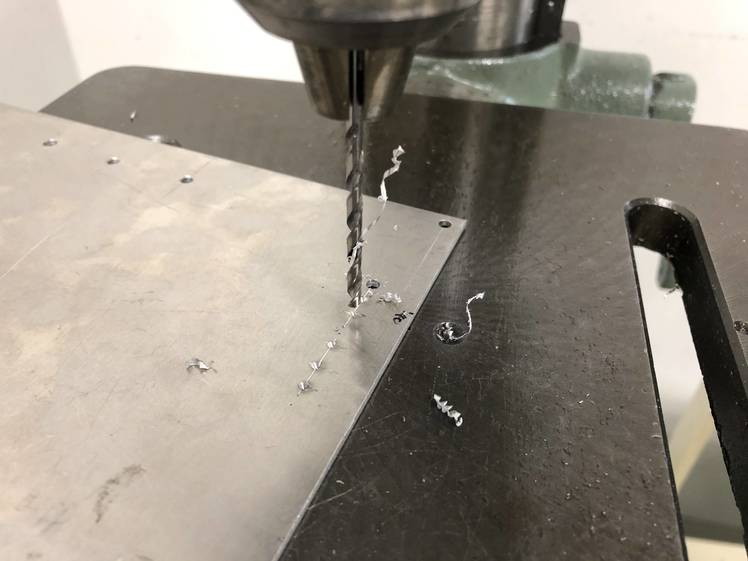

直径13mmまでの穴を開ける際に利用します。罫書き台で線を引き、ポンチで位置合わせをした後にボール盤で穴を開けるという流れが通例です。罫書き台で正確に線を引くことができれば0.02mm単位程度の精度で穴を開けることができます。

実際に解説動画を制作しました（初めてなので質が低い）

<iframe src="https://drive.google.com/file/d/1VT8coQHQ2b63Rgq0zXitO6EZzDAzXCQO/preview" width="640" height="480" allow="autoplay"></iframe>

## 3. 第５回設計課題
今回の設計課題については [こちら](exercise_5.md) をご覧ください。

---

[第４回](main-mecha_2.md)　　　[ホーム](index.md)　　　[第６回](Lecture6.md)